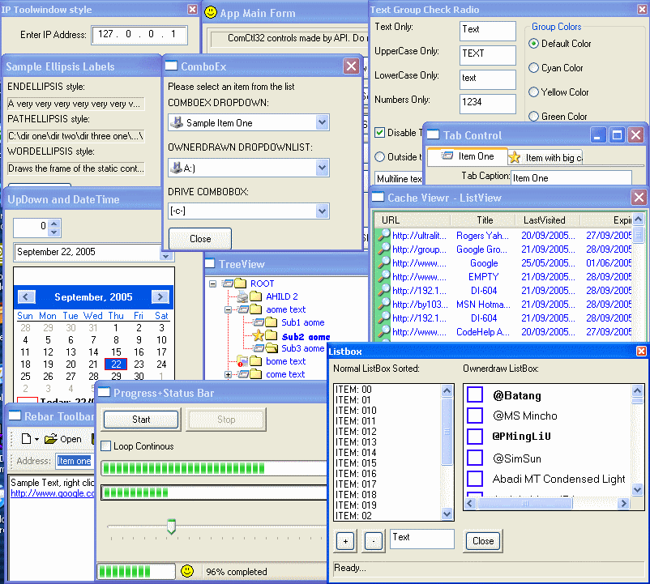



## WinApiForVB type library and AllApiDemo \(updated\)

### Description

WinApiForVb library contains over 900 KB of API declarations, constants, ... for both ANSI and Unicode. I put it together so as to do away with copying and pasting API declarations from project to project along with a number of other reasons (mainly string handling and interfaces). The AllApiDemo, as the name states, is a project which demonstartes how to create and use (using only API) all gui and some none gui elements ranging from a simple elements such as buttons to richedit, treeview, imagelist, ... To use, copy the type library from WinApiForVb_Compiled folder to your system folder. Open up AllApiDemp project or any other and go to preferences, find =&gt; WinApi For VB type library &lt;= entry, select it and click ok. Now you should see the contents of the library in object browser. BTW, those who are thinknig about dependencies, a compiled project, does not need the type library to be present in the client's pc to run. VB includes the necessary API declarations in the exe.

----

Minor changes;

----

Corrected some problems with data type declaration in interfaces. Added IEnumSTATURL, IUrlHistoryStg, IUrlHistoryStg2 interfaces, STATURL type, STATURLFLAGS, and STATURL_QUERYFLAGS enums .Modified the listview form to use the new interfaces to read and display IE history. Replaced the snapshot.

Peace

MH
 
### More Info
 

             |
---                |---
**Submitted On**   |2005-09-22 08:49:04
**By**             |[MH](https://github.com/Planet-Source-Code/PSCIndex/blob/master/ByAuthor/mh.md)
**Level**          |Intermediate
**User Rating**    |4.9 (118 globes from 24 users)
**Compatibility**  |VB 6\.0
**Category**       |[Libraries](https://github.com/Planet-Source-Code/PSCIndex/blob/master/ByCategory/libraries__1-49.md)
**World**          |[Visual Basic](https://github.com/Planet-Source-Code/PSCIndex/blob/master/ByWorld/visual-basic.md)
**Archive File**   |[WinApiForV1934509222005\.zip](https://github.com/Planet-Source-Code/mh-winapiforvb-type-library-and-allapidemo-updated__1-62060/archive/master.zip)

